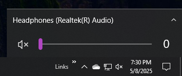
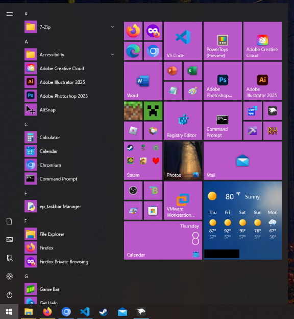
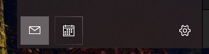
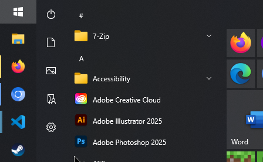

# WindhawkStyles

A collection of my miscellaneous Windhawk styler mod styles that are either too small or too niche to be themes.

## 10FlyoutFix

_Notification Center Styler_

Removes the white focus outlines and restores the Windows 10 fonts when using the Windows 10 tray flyouts on Windows 11.

## 11TaskbarOnTopFix

_Taskbar Styler_

Puts the running indicator on top of the icons. Makes the bounce animation come from the correct directions.

## 2004Start

_Start Menu Styler_

Restores colored tiles and text margins on the Windows 10 Start Menu, last seen in version 2004. Only applies accent color as getting icons' dominant color is not possible with the styler mods. Mainly for Windows 11 with the 10 Start menu, as Windows 10 has a better alternative.

_Original implementation by [Tails](https://github.com/milestprower92)._

## MailCalenderCleanup
[_Mail and Calender Styler_](mods/mail-and-calender-styler.wh.cpp)

Cleans up the buttons on the bottom of the nav pane and removes the Outlook ad, people button, and to-do button.

## FlippedNavPane

_Start Menu Styler_

Reverses the direction of the Windows 10 Start Menu's navigation pane, so commonly used buttons are at the top. This is convenient when the taskbar is aligned to the left or top, as your mouse needs to travel less distance to reach the buttons.

## GrooveMusicCleanup
[_Groove Music Styler_](mods/groove-music-styler.wh.cpp)

Removes the Spotify ad and the Sign In button from the bottom of the nav pane.